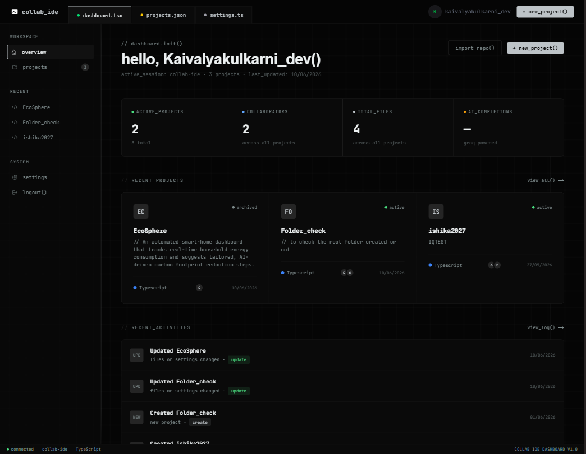
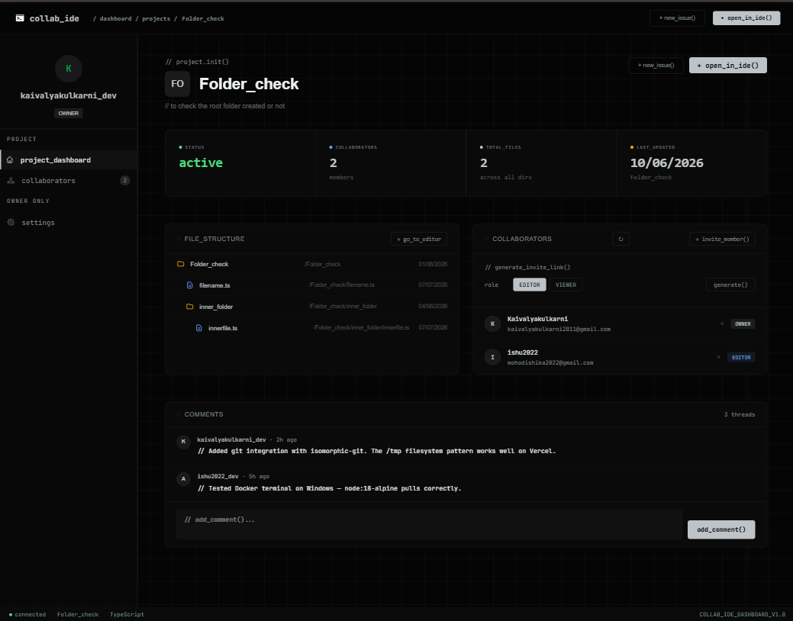

# Collab IDE

<p align="center">
  
</p>

<h1 align="center">Collab IDE</h1>

<p align="center">
A modern browser-based collaborative IDE built with Next.js, Monaco Editor, Yjs, Docker, PostgreSQL and AI-assisted development.
</p>

<p align="center">


</p>

---

# Live Demo

https://collab-ide-nine.vercel.app

Repository:

https://github.com/Kaivalyakulkarni/collab-Ide

---

# Overview

Collab IDE is a full-stack cloud development environment designed to recreate the experience of a modern desktop IDE directly inside the browser. The project combines real-time collaborative editing, isolated code execution, Git workflows, AI-assisted development, and project management into a unified workspace.

Instead of focusing on only one aspect of software development, the application aims to support the complete workflow followed by modern development teams—from project creation and contributor management to writing, executing, and committing code.

The editor is powered by Monaco, synchronization is handled through Yjs CRDTs over WebSockets, execution occurs inside disposable Docker containers, and authentication is implemented using GitHub OAuth with NextAuth.

---

# Philosophy

Most browser IDEs excel in one domain:

- collaboration
- execution
- AI assistance
- project management

Collab IDE attempts to combine all of these capabilities into a single coherent platform while preserving a familiar developer experience.

The objective is not to replace desktop IDEs, but to make collaborative development frictionless for teams that need to prototype, learn, or build together without installing a local environment.

---

# Screenshot Showcase

## Dashboard

<p align="center">

</p>

The dashboard serves as the central hub for projects, recent activity, invitations, and developer productivity.

---

## Project Workspace

<p align="center">

</p>

Each project includes contributors, project metadata, discussions, settings, and quick access to the collaborative editor.

---

## Collaborative Editor

<p align="center">

</p>

The editor integrates Monaco, Docker-backed terminals, Git operations, AI completions, and real-time collaboration into a VS Code–inspired workspace.

---

# Core Capabilities

## Real-Time Collaboration

- Simultaneous editing
- Presence awareness
- Colored cursors
- Conflict-free synchronization
- Shared project workspace

## Development Environment

- Monaco Editor
- Multi-file workspace
- File explorer
- Integrated terminal
- Git panel
- AI inline completion

## Project Management

- GitHub authentication
- Team invitations
- Contributor management
- Project dashboard
- Settings and metadata

## Execution

Every execution request is isolated inside a Docker container, preventing user code from affecting the host application.

---

# High-Level Architecture

```text
Browser
   │
   ▼
Next.js App Router
   │
   ├── Authentication
   ├── Dashboard
   ├── Collaborative Editor
   └── API Routes
          │
          ▼
      Prisma ORM
          │
          ▼
 Supabase PostgreSQL

Realtime Layer

Monaco Editor
      │
      ▼
     Yjs
      │
      ▼
 WebSocket Server

Execution

Editor
   │
   ▼
Docker Sandbox
   │
   ▼
node-pty + xterm.js
```

---

# Technology Overview

| Area | Technology |
|------|------------|
| Frontend | Next.js, React, TypeScript |
| Styling | Tailwind CSS |
| Editor | Monaco |
| Collaboration | Yjs, y-monaco |
| Realtime | WebSocket |
| AI | Groq |
| Execution | Docker, node-pty, xterm.js |
| Database | PostgreSQL, Prisma, Supabase |
| Authentication | NextAuth v5 |
| Landing Page | React Three Fiber, GSAP |

---

# What Makes This Project Different

Unlike many educational IDE projects, Collab IDE focuses on integrating several production-inspired systems into one application:

- Real-time CRDT-based editing
- Secure containerized execution
- AI-assisted coding
- Browser-native Git workflow
- Project and collaborator management
- Modern animated landing experience


# Product Walkthrough

Collab IDE is designed around the idea that developers should not have to switch between multiple tools during the software development lifecycle. Rather than treating the editor, terminal, version control, collaboration, and project management as independent applications, Collab IDE integrates them into a single browser-native workspace.

Every screen in the application has been designed with this philosophy in mind. The dashboard helps developers organize projects, the project workspace acts as a collaboration hub, and the editor provides everything required to write, execute, and manage code.

---

# Dashboard

<p align="center">
    
</p>

The dashboard is the first screen users interact with after authentication. Instead of simply listing projects, it acts as a central workspace where users can quickly understand everything happening across their development environment.

The interface is intentionally minimal while still surfacing the information that matters most.

The dashboard allows users to:

- View all active projects
- Create new collaborative projects
- Browse recent activity
- View pending invitations
- Access project statistics
- Navigate directly into the editor
- Manage account information
- Access project settings

Unlike many dashboards that simply display cards, this dashboard is designed to reduce navigation by exposing frequently used actions immediately.

---

# Project Cards

Each project is represented as a compact summary card.

Rather than only displaying the project title, every card contains contextual information that helps developers understand the current state of the project before opening it.

Each card includes:

- Project name
- Description
- Technology stack
- Contributor count
- Last activity
- Project owner
- Visibility
- Quick navigation

The intention is that a developer can identify the correct project within seconds without opening multiple pages.

---

# Creating a Project

Creating a collaborative workspace is intentionally straightforward.

Users are guided through a structured workflow where the required project information is collected before the workspace is initialized.

The creation process includes:

- Project title
- Description
- Programming language
- Visibility
- Initial collaborators
- Repository information
- Project metadata

Once submitted, the project is persisted in PostgreSQL through Prisma and becomes immediately available inside the dashboard.

---

# Project Workspace

<p align="center">
    
</p>

The project workspace serves as the operational center for every collaborative project.

Instead of immediately opening the editor, developers first enter a workspace where project information, contributors, discussions, and management tools are available.

This separation keeps project administration independent from the coding experience.

The workspace currently includes:

- Overview
- Contributors
- Discussions
- Settings
- Project information
- Quick access to the editor

As additional functionality is introduced, these sections can be expanded without affecting the editor experience.

---

# Contributor Management

Modern software development is collaborative.

For this reason, contributor management is treated as a first-class feature rather than an afterthought.

Project owners can manage collaborators directly from the workspace.

Supported operations include:

- Invite contributors
- Remove collaborators
- View member roles
- Transfer ownership
- Generate invitation links
- Manage permissions

The permission model has been designed so that future role-based access control can be added without restructuring the application.

---

# Invitation System

Collaboration begins with inviting developers into a workspace.

Rather than manually creating accounts or exchanging credentials, invitation tokens provide a secure mechanism for joining projects.

The invitation workflow follows these steps:

1. Owner generates an invitation.
2. A unique token is created.
3. The token is shared with another developer.
4. The invited developer authenticates using GitHub.
5. Membership is verified.
6. Access is granted automatically.

This approach keeps onboarding simple while maintaining project security.

---

# Editor Workspace

<p align="center">
    
</p>

The editor is the core of the entire platform.

Every surrounding feature ultimately exists to support this workspace.

The design intentionally resembles a professional desktop IDE so that developers immediately feel comfortable.

The editor consists of multiple integrated components that work together as a single environment.

These include:

- File Explorer
- Monaco Editor
- Terminal
- Git Panel
- AI Assistant
- Status Bar
- Presence Indicators
- Multi-file Tabs

Because these tools are tightly integrated, developers rarely need to leave the browser while working.

---

# File Explorer

The file explorer provides a hierarchical representation of the project directory.

Users can perform common file operations directly from the interface without using terminal commands.

Supported operations include:

- Create files
- Create folders
- Rename files
- Rename folders
- Delete resources
- Navigate nested directories

The interface automatically updates after each operation, ensuring the project tree always reflects the current filesystem state.

---

# Multi-file Editing

Modern development rarely involves editing a single file.

To support realistic workflows, multiple files can remain open simultaneously.

Each file opens inside its own Monaco tab.

Developers can switch instantly between files while preserving editor state.

This creates an experience comparable to desktop editors like Visual Studio Code.

---

# Breadcrumb Navigation

Breadcrumbs display the current file hierarchy.

Instead of relying solely on the file explorer, developers always know exactly where the active file exists within the project.

This becomes increasingly valuable as projects grow larger.

---

# Status Bar

The status bar provides contextual information about the current editing session.

Examples include:

- AI completion state
- Active file
- Editor status
- Collaboration state
- Connection status

Because the information is always visible, developers rarely need to search through menus to understand the editor's current state.

---

# Integrated Terminal

A development environment is incomplete without a terminal.

While many browser-based editors focus only on file editing, Collab IDE integrates a fully interactive terminal directly into the workspace, allowing developers to compile, execute, and debug applications without leaving the browser.

The terminal is built using **xterm.js** for rendering and **node-pty** for process communication, providing an experience that closely resembles a native terminal application.

Unlike lightweight console implementations, the terminal maintains a persistent interactive session, allowing developers to execute multiple commands sequentially during development.

---

# Docker-Powered Code Execution

Executing arbitrary user code directly on the application server introduces significant security risks.

To address this, every execution request is isolated inside a disposable Docker container.

The execution pipeline follows these steps:

1. The current workspace is synchronized.
2. Required project files are written to a temporary workspace.
3. A Docker container is created.
4. The workspace is mounted into the container.
5. Commands are executed through node-pty.
6. Output is streamed back to xterm.js in real time.
7. Temporary resources are cleaned up once execution finishes.

This architecture ensures that user code never executes directly on the host server while preserving an interactive development experience.

Advantages include:

- Process isolation
- Filesystem isolation
- Safe execution of arbitrary code
- Disposable runtime environments
- Consistent execution across projects

---

# Live Output Streaming

Instead of waiting for execution to complete before returning output, terminal data is streamed incrementally.

This provides immediate feedback during execution, making long-running programs feel responsive.

Developers can observe:

- Build progress
- Compilation errors
- Runtime exceptions
- Console logs
- Interactive prompts

Streaming output significantly improves the usability of the editor compared to traditional request-response execution models.

---

# Git Integration

Version control is an essential part of modern software development.

Rather than requiring users to open an external terminal and execute Git commands manually, Collab IDE exposes common Git workflows through a dedicated interface.

The implementation is powered by **isomorphic-git**, allowing repository operations directly inside the browser.

Current capabilities include:

- Initialize repository
- View repository status
- Stage changes
- Commit updates

The interface is intentionally simple while providing enough functionality for day-to-day development.

As the project evolves, additional Git workflows such as branching, merging, pull, push, and remote synchronization can be introduced without changing the overall interface.

---

# AI-Assisted Development

One of the defining features of Collab IDE is the integration of AI-powered inline code completion.

Rather than opening a separate chat interface, suggestions appear directly inside the editor as developers type.

This interaction model closely mirrors modern AI-assisted development tools while remaining fully integrated into the editing experience.

The system is powered by Groq's **llama-3.3-70b-versatile** model.

Suggestions are delivered through Monaco Editor's `InlineCompletionsProvider`, allowing completions to behave as native editor features rather than external overlays.

Key capabilities include:

- Context-aware suggestions
- Inline ghost text
- Low-latency responses
- Adjustable completion strength
- Enable/disable controls from the status bar

The objective is to assist developers without interrupting their workflow.

---

# Real-Time Collaboration

Collaboration is implemented using **Yjs**, a Conflict-free Replicated Data Type (CRDT) library designed for distributed editing.

Unlike traditional locking systems, CRDTs allow multiple users to edit the same document simultaneously without introducing merge conflicts.

Every participant maintains a synchronized copy of the document.

Local edits are propagated through the WebSocket server and merged deterministically across all connected clients.

This architecture provides:

- Near real-time synchronization
- Conflict-free editing
- Offline-friendly document structures
- Reliable state convergence

Developers can collaborate naturally without worrying about overwriting one another's work.

---

# Presence Awareness

Collaboration extends beyond document synchronization.

The editor also communicates the presence of connected collaborators.

Users are able to see:

- Active participants
- Colored cursors
- Live cursor movement
- Selection updates
- Current editing locations

Presence awareness improves communication by making collaboration feel more natural and reducing accidental editing conflicts.

---

# Authentication

Access to the platform is secured through GitHub OAuth using NextAuth v5.

Developers authenticate using their GitHub accounts, eliminating the need for traditional username/password registration.

The authentication layer has been customized due to compatibility limitations between Prisma's latest driver adapter and the standard NextAuth Prisma adapter.

Instead of relying on the default implementation, authentication is performed using carefully structured raw SQL queries executed through Prisma.

This approach maintains compatibility while preserving the flexibility of NextAuth's session management.

---

# Project Security

Several design decisions prioritize security throughout the application.

These include:

- GitHub OAuth authentication
- Server-side session validation
- Docker sandbox isolation
- Temporary execution environments
- Protected API routes
- Controlled collaborator access
- Invitation token verification

Although Collab IDE is intended primarily as a learning and collaboration platform, these measures establish a solid security foundation for future expansion.

---

# Responsive Experience

The interface has been designed to function across a wide range of devices.

Rather than simply hiding complex desktop components through CSS, the landing page uses conditional rendering to avoid mounting expensive WebGL scenes on smaller devices.

For desktop users:

- Interactive React Three Fiber scene
- GSAP-driven animations
- Scroll-triggered transitions
- Shader-based visual effects

For mobile users:

- Lightweight static interface
- Reduced rendering overhead
- Improved battery efficiency
- Faster loading times

This design choice prioritizes performance while preserving the visual identity of the application.

---

# User Experience Principles

Throughout the application, several guiding principles influence interface design.

### Familiarity

The editor intentionally resembles desktop development environments to minimize the learning curve.

### Consistency

Common actions appear in predictable locations throughout the application.

### Responsiveness

Animations enhance usability without delaying interaction.

### Simplicity

Complex workflows are broken into manageable interfaces rather than exposing unnecessary configuration.

### Performance

Large visual features are loaded only when required, reducing resource consumption.

---

# Summary

Collab IDE is more than an online code editor.

It combines project management, collaborative editing, secure code execution, AI-assisted development, Git workflows, and modern interface design into a unified browser-native development environment.

The following section explores the engineering decisions, system architecture, and implementation details that make these capabilities possible.


# System Architecture

Collab IDE has been designed as a modular full-stack application where each subsystem is responsible for a well-defined part of the development workflow. Rather than relying on a monolithic backend, the application combines several independent services that work together to provide a seamless browser-based development experience.

At a high level, the architecture consists of five major layers:

- Client Application
- Application Server
- Database
- Real-Time Collaboration Layer
- Execution Environment

Each layer is responsible for a specific concern, making the application easier to maintain, extend, and scale.

---

# Overall Architecture

```text
                               Browser

                                   │

                 ┌─────────────────┴─────────────────┐
                 │                                   │
                 ▼                                   ▼

         React Components                     React Three Fiber

                 │
                 ▼

          Next.js App Router

                 │

      ┌──────────┼──────────┐
      ▼          ▼          ▼

 Authentication  Editor   Dashboard

      │          │          │
      └──────────┼──────────┘
                 ▼

             API Routes

                 │

     ┌───────────┼────────────┐
     ▼           ▼            ▼

 PostgreSQL   WebSocket     Docker
  Prisma        Server      Sandbox

                 │

                 ▼

             Monaco + Yjs

                 │

                 ▼

          Connected Clients
```

---

# Application Layers

## Presentation Layer

The presentation layer is responsible for rendering the user interface.

It includes:

- Dashboard
- Landing Page
- Project Workspace
- Collaborative Editor
- Authentication Screens
- Project Settings
- Git Interface
- Terminal

The interface is built using React Server Components where appropriate, reducing unnecessary client-side JavaScript while improving initial load performance.

---

## Business Logic Layer

The application logic lives primarily inside Next.js API Routes.

Responsibilities include:

- Authentication
- Project management
- Contributor management
- Invitation handling
- File operations
- Git operations
- AI requests
- Database communication

Separating business logic from presentation keeps the codebase maintainable and enables future migration to dedicated backend services if required.

---

## Persistence Layer

Persistent application data is stored inside PostgreSQL.

Prisma acts as the ORM responsible for:

- Schema management
- Type-safe database queries
- Relationships
- Migrations
- Transactions

The relational model naturally represents users, projects, collaborators, files, invitations, and permissions.

---

# Database Design

The database forms the foundation of the platform.

Major entities include:

```text
User
 │
 ├── Projects
 │
 ├── Invitations
 │
 ├── Sessions
 │
 └── Accounts

Project
 │
 ├── Files
 ├── Members
 ├── Discussions
 ├── Git History
 └── Settings
```

Each project maintains relationships with collaborators and project resources, enabling efficient querying without data duplication.

---

# Authentication Flow

Authentication is handled using GitHub OAuth through NextAuth v5.

The authentication lifecycle follows this sequence:

```text
User

 │

 ▼

Login Button

 │

 ▼

GitHub OAuth

 │

 ▼

Authorization Code

 │

 ▼

NextAuth

 │

 ▼

Custom SQL Adapter

 │

 ▼

PostgreSQL

 │

 ▼

Authenticated Session
```

Unlike the standard Prisma adapter, a custom raw SQL implementation is used to ensure compatibility with Prisma's latest PostgreSQL driver.

---

# Why a Custom NextAuth Adapter?

One of the more interesting engineering decisions within the project is the authentication implementation.

During development, Prisma's newer PostgreSQL driver adapter introduced compatibility issues with the official NextAuth Prisma adapter.

Instead of downgrading dependencies or abandoning Prisma, a custom adapter was implemented using raw SQL queries executed through Prisma.

Benefits include:

- Full compatibility
- Better control
- Type safety
- Future flexibility
- Cleaner debugging

This demonstrates an engineering-first approach where the implementation adapts to technical constraints rather than forcing the project to depend on unsupported configurations.

---

# Real-Time Collaboration

Real-time editing is powered by Yjs.

Unlike traditional operational transformation systems, Yjs uses Conflict-free Replicated Data Types (CRDTs).

Every connected client maintains its own copy of the document.

Local edits are immediately applied.

Updates are synchronized through the WebSocket server and merged deterministically across all participants.

```text
Developer A

     │

     ▼

Local Document

     │

     ▼

Yjs Update

     │

     ▼

WebSocket Server

     │

 ┌───┴────┐

 ▼        ▼

User B   User C
```

This architecture guarantees eventual consistency while eliminating merge conflicts.

---

# Presence Synchronization

Editing alone is not enough.

The collaboration system also synchronizes user presence.

Every client broadcasts:

- Cursor location
- Selection range
- Active document
- User identity
- Connection state

These updates allow developers to understand what teammates are doing without interrupting their workflow.

---

# Monaco Integration

Monaco Editor serves as the editing engine.

Instead of building a custom editor, the project integrates the same technology used by Visual Studio Code.

Advantages include:

- Professional editing experience
- Syntax highlighting
- Language support
- IntelliSense APIs
- Decorations
- Inline completions

Yjs binds directly to Monaco through **y-monaco**, allowing collaborative editing without modifying Monaco's internal implementation.

---

# AI Completion Pipeline

Inline AI suggestions are integrated directly into Monaco.

The request lifecycle is intentionally lightweight.

```text
Developer Types

        │

        ▼

Current Cursor Context

        │

        ▼

Groq API

        │

        ▼

LLM Response

        │

        ▼

InlineCompletionsProvider

        │

        ▼

Ghost Text Suggestion
```

Unlike chat-based assistants, suggestions appear directly within the editing flow, minimizing disruption.

---

# Docker Execution Pipeline

Executing arbitrary code safely requires strict isolation.

Every execution request follows the same lifecycle.

```text
Open Workspace

        │

        ▼

Synchronize Files

        │

        ▼

Temporary Directory

        │

        ▼

Docker Container

        │

        ▼

node-pty

        │

        ▼

xterm.js

        │

        ▼

Terminal Output
```

The container is discarded after execution, ensuring that no state leaks between sessions.

---

# File Synchronization

One challenge of browser-based IDEs is maintaining consistency between the editor and the execution environment.

Before execution:

- Files are collected
- Changes are synchronized
- Temporary workspace is created
- Docker mounts the workspace
- Execution begins

After execution:

- Output is streamed
- Temporary resources are removed
- Editor remains synchronized

This guarantees that the code executed always matches what the developer sees inside the editor.

---

# Git Workflow

Git functionality is implemented entirely in the browser using **isomorphic-git**.

Typical workflow:

```text
Modified Files

      │

      ▼

Status

      │

      ▼

Stage

      │

      ▼

Commit

      │

      ▼

Repository Updated
```

Removing dependence on the system Git executable makes the feature platform-independent and easier to integrate into the browser environment.

---

# Landing Page Architecture

The landing page is intentionally separated from the application dashboard.

Rather than functioning as a static marketing page, it demonstrates several frontend engineering techniques.

These include:

- React Three Fiber
- GSAP ScrollTrigger
- Shader gradients
- Conditional rendering
- Scroll-based storytelling

Desktop users receive a fully interactive WebGL experience.

Mobile users receive an optimized static layout where the 3D scene is never mounted, reducing GPU usage and improving load times.

---

# Scalability Considerations

The architecture has been designed with future growth in mind.

Potential future improvements include:

- Dedicated microservices
- Redis caching
- Horizontal WebSocket scaling
- Object storage for project assets
- Background job queues
- Multi-region deployment

Because each subsystem has clear responsibilities, these upgrades can be introduced without significant architectural changes.

---

# Architectural Principles

Throughout development, several principles guided implementation decisions:

- Separation of concerns
- Developer-first user experience
- Security through isolation
- Modular design
- Progressive enhancement
- Performance over unnecessary abstraction
- Familiar desktop-inspired workflows

These principles influenced nearly every component of the project and continue to provide a foundation for future development.

---

# Engineering Decisions

Every technology used in Collab IDE was selected to solve a specific problem rather than simply following popular trends. Throughout development, priority was given to technologies that improved developer experience, maintainability, scalability, and long-term flexibility.

The following sections explain the reasoning behind each major architectural decision.

---

# Why Next.js?

Instead of using a traditional React application with a separate backend, the project is built using the Next.js App Router.

This approach provides several advantages:

- Server Components
- File-based routing
- API Routes
- Dynamic rendering
- Simplified deployment
- Better performance
- Built-in optimization

The App Router also allows frontend and backend logic to coexist within a single project while maintaining a clean architecture.

---

# Why TypeScript?

A project of this size involves dozens of interconnected modules.

Using TypeScript significantly improves maintainability by providing:

- Static type checking
- Better IDE support
- Safer refactoring
- Improved autocomplete
- Clear API contracts

As the application grows, strong typing reduces runtime errors and makes collaboration easier.

---

# Why Prisma ORM?

Managing SQL queries manually quickly becomes difficult as projects increase in complexity.

Prisma provides:

- Type-safe queries
- Schema-driven development
- Automatic migrations
- Strong relational modeling
- Excellent TypeScript integration

Because PostgreSQL is highly relational, Prisma becomes an ideal bridge between the database and application logic.

---

# Why PostgreSQL?

Projects naturally contain relationships.

Examples include:

- User → Projects
- Project → Files
- Project → Members
- User → Sessions
- User → Invitations

Representing these relationships inside a relational database simplifies querying while maintaining consistency.

PostgreSQL also provides:

- ACID compliance
- Excellent indexing
- Strong transactional guarantees
- Mature ecosystem
- High scalability

---

# Why Supabase?

Instead of hosting PostgreSQL independently, Supabase provides:

- Managed database hosting
- Reliable backups
- Connection pooling
- Easy deployment
- Excellent compatibility with Prisma

Using Supabase reduced operational overhead while allowing development to focus on application features.

---

# Why Monaco Editor?

The editor represents the heart of the application.

Rather than creating a custom code editor, Monaco provides the same editing engine used by Visual Studio Code.

Advantages include:

- Familiar interface
- Language services
- Syntax highlighting
- Code folding
- Multiple cursors
- Decoration APIs
- Rich extension support

Using Monaco immediately elevates the editing experience to production-quality standards.

---

# Why Yjs?

Collaborative editing is difficult.

Traditional synchronization approaches often rely on Operational Transformation (OT), which becomes increasingly complex as concurrency increases.

Yjs instead uses Conflict-free Replicated Data Types (CRDTs).

Benefits include:

- Automatic conflict resolution
- Eventual consistency
- Offline editing
- Low synchronization overhead
- Deterministic merging

This significantly simplifies collaborative editing while improving reliability.

---

# Why WebSockets?

HTTP works well for request-response interactions but is inefficient for continuously synchronized applications.

Real-time collaboration requires persistent communication.

WebSockets provide:

- Full duplex communication
- Low latency
- Reduced overhead
- Continuous synchronization

Without WebSockets, collaborative editing would feel slow and disconnected.

---

# Why Docker?

Allowing users to execute arbitrary programs presents major security concerns.

Docker isolates every execution request from the application itself.

Each execution environment is:

- Temporary
- Disposable
- Isolated
- Independent

Benefits include:

- Improved security
- Consistent runtime
- Easy cleanup
- Better resource isolation

This architecture prevents user programs from affecting the host application.

---

# Why node-pty?

Interactive terminals require bidirectional communication between browser and operating system processes.

node-pty creates pseudo terminals that behave similarly to native shells.

Advantages include:

- Interactive command execution
- Continuous output
- Signal support
- Familiar terminal behavior

Combined with xterm.js, this produces an experience similar to desktop IDE terminals.

---

# Why xterm.js?

Rendering terminal output inside the browser requires more than displaying text.

xterm.js provides:

- ANSI color support
- Interactive shell rendering
- Keyboard shortcuts
- Scrollback history
- Cursor control

This allows developers to use familiar terminal workflows directly inside the application.

---

# Why isomorphic-git?

Traditional Git relies on native executables installed on the operating system.

A browser application cannot assume that Git exists on the client.

isomorphic-git implements Git entirely in JavaScript.

Benefits include:

- Browser compatibility
- Cross-platform consistency
- Zero external dependencies
- Easy integration

This makes Git functionality accessible without leaving the application.

---

# Why Groq?

AI-assisted development requires low response latency.

Groq's inference platform provides extremely fast completion speeds while maintaining high-quality suggestions.

The model currently integrated into the editor is:

```
llama-3.3-70b-versatile
```

The goal is not to replace developers, but to reduce repetitive typing and accelerate common coding tasks.

---

# Why React Three Fiber?

The landing page was designed to demonstrate frontend engineering rather than simply advertise the application.

React Three Fiber enables:

- WebGL rendering
- Interactive scenes
- Camera animations
- Shader effects
- Rich storytelling

Rather than embedding videos, the landing page becomes an interactive experience.

---

# Why GSAP?

Smooth animations require more control than standard CSS transitions.

GSAP provides:

- Timeline control
- ScrollTrigger
- High-performance animations
- Sequenced interactions
- Fine-grained control

This enables cinematic landing page experiences while maintaining smooth performance.

---

# Performance Optimizations

Several optimizations have been implemented throughout the project.

## React Server Components

Server rendering reduces client-side JavaScript while improving initial load times.

---

## Dynamic Imports

Heavy components are loaded only when required.

Examples include:

- Monaco
- React Three Fiber
- Terminal
- Large editor modules

---

## Conditional R3F Mounting

Instead of merely hiding the WebGL scene on mobile devices, the component is never mounted.

This avoids:

- WebGL initialization
- Render loops
- GPU memory usage
- Unnecessary JavaScript execution

This optimization significantly improves mobile performance.

---

## Efficient Synchronization

Only document updates are transmitted between collaborators.

Entire files are never repeatedly synchronized.

This minimizes bandwidth while improving responsiveness.

---

## Database Pooling

Supabase's pooling configuration reduces connection overhead in serverless environments.

This is especially important when deploying Next.js applications on Vercel.

---

# Security Considerations

Several architectural decisions prioritize security.

These include:

- OAuth authentication
- Server-side session validation
- Protected API routes
- Docker sandbox isolation
- Temporary execution environments
- Invitation verification
- Controlled project membership

Although Collab IDE is primarily an educational project, security considerations were incorporated throughout development rather than treated as an afterthought.

---

# Challenges Encountered

Developing Collab IDE required solving a number of engineering challenges.

Some of the most significant included:

- Synchronizing Monaco with Yjs
- Managing WebSocket state
- Integrating Docker execution
- Handling authentication compatibility issues
- Building browser-native Git workflows
- Coordinating editor state across collaborators
- Optimizing Three.js performance
- Maintaining responsive layouts

Each challenge required researching existing solutions while adapting them to the project's specific architecture.

---

# Lessons Learned

Building Collab IDE provided valuable experience in:

- Distributed systems
- Collaborative editing
- Authentication
- Database modeling
- Containerization
- API design
- Performance optimization
- Frontend architecture
- State synchronization

More importantly, it demonstrated how multiple independent technologies can be combined into a cohesive developer platform.

---

# Looking Forward

The current architecture provides a strong foundation for future expansion.

Potential directions include:

- Branch management
- Pull request workflows
- Live pair programming tools
- Shared debugging sessions
- Integrated testing pipelines
- Plugin architecture
- Workspace templates
- Team organizations

Because the application has been designed using modular principles, these additions can be implemented without major architectural changes.

---

# Getting Started

This section explains how to set up Collab IDE for local development.

The project consists of several independent services working together:

- Next.js application
- PostgreSQL database
- WebSocket collaboration server
- Docker runtime
- AI provider
- GitHub OAuth

Before starting the project, ensure all required dependencies are installed and configured.

---

# Prerequisites

The following software should already be installed on your machine.

## Required

- Node.js 20+
- npm
- Docker Desktop
- Git
- PostgreSQL (or Supabase project)

---

# Clone the Repository

```bash
git clone https://github.com/Kaivalyakulkarni/collab-Ide.git

cd collab-Ide
```

---

# Install Dependencies

```bash
npm install
```

This installs both application and development dependencies required by the project.

---

# Configure Environment Variables

Create a file named

```text
.env.local
```

and add the following variables.

```env
AUTH_SECRET=

AUTH_GITHUB_ID=

AUTH_GITHUB_SECRET=

DATABASE_URL=

DIRECT_URL=

GROQ_API_KEY=

WEBSOCKET_URL=
```

### Variable Description

| Variable | Purpose |
|------------|--------------------------------|
| AUTH_SECRET | NextAuth encryption secret |
| AUTH_GITHUB_ID | GitHub OAuth Client ID |
| AUTH_GITHUB_SECRET | GitHub OAuth Secret |
| DATABASE_URL | PostgreSQL connection string |
| DIRECT_URL | Direct database connection for Prisma |
| GROQ_API_KEY | AI completion API |
| WEBSOCKET_URL | Collaboration server |

---

# Database Setup

Push the Prisma schema.

```bash
npx prisma db push
```

Seed the initial data.

```bash
npx prisma db seed
```

Launch Prisma Studio if required.

```bash
npx prisma studio
```

---

# Running the Project

Start the development server.

```bash
npm run dev
```

The application will be available at

```
http://localhost:3000
```

---

# Docker

Docker is required for code execution.

Before launching the editor ensure Docker Desktop is running.

Execution will not function if Docker is unavailable.

Each execution request creates an isolated container before running user code.

After execution completes, the container is automatically destroyed.

---

# Running the WebSocket Server

Real-time collaboration depends on the WebSocket server.

Start it separately according to your deployment configuration.

The collaboration layer is responsible for:

- Document synchronization
- Presence
- Cursor updates
- CRDT updates

Without this service the editor continues to function, but collaborative editing is disabled.

---

# Project Structure

A simplified overview of the repository is shown below.

```text
.

├── app
│   ├── (auth)
│   ├── api
│   ├── dashboard
│   ├── editor
│   └── landing
│
├── components
│
├── hooks
│
├── lib
│
├── prisma
│
├── public
│
├── styles
│
├── types
│
├── websocket-server
│
└── middleware.ts
```

The repository follows a modular organization where each directory has a clear responsibility.

---

# Deployment

The application is designed around a distributed deployment model.

```text
                 Users

                   │

                   ▼

              Vercel Frontend

                   │

      ┌────────────┴────────────┐

      ▼                         ▼

 Supabase PostgreSQL     Render WebSocket

      │

      ▼

 Docker Runtime
```

Current deployment services include

- Vercel
- Render
- Supabase
- GitHub OAuth
- Groq

Each service focuses on one responsibility, reducing operational complexity.

---

# Browser Compatibility

Collab IDE has been tested with modern browsers supporting:

- WebSockets
- ES Modules
- WebGL
- Service Workers

Recommended browsers include:

- Chrome
- Edge
- Firefox

---

# Accessibility

Several interface decisions improve accessibility.

Examples include:

- High contrast dark interface
- Keyboard navigation
- Large click targets
- Consistent layouts
- Readable typography

Future improvements may include expanded screen reader support and additional accessibility preferences.

---

# Development Principles

Several principles guided the development process.

## Developer Experience

Every feature should reduce friction during development.

---

## Simplicity

Interfaces should expose only the functionality required for common workflows.

---

## Modularity

Independent systems should remain loosely coupled.

---

## Maintainability

Readable code is preferred over clever implementations.

---

## Performance

Heavy components should only load when required.

---

## Security

User code should never execute directly on the application server.

---

# Major Features Recap

Collab IDE currently includes

- Browser-native IDE
- Monaco Editor
- Real-time collaboration
- CRDT synchronization
- Docker-backed execution
- Integrated terminal
- Git workflows
- AI code completion
- GitHub authentication
- Project dashboard
- Contributor management
- Animated landing page
- Responsive interface
- PostgreSQL persistence

These systems work together to create a unified collaborative development platform.

---

# Future Scope

Although Collab IDE already provides a complete collaborative development environment, several ideas remain possible.

Examples include

- Branch management
- Pull requests
- Workspace templates
- Plugin system
- Live debugging
- Shared terminals
- Project analytics
- Organization support
- Cloud deployments
- Code review tools

The current architecture was intentionally designed so these features can be introduced incrementally.

---

# Contributing

Contributions are welcome.

If you would like to improve the project:

1. Fork the repository.

2. Create a feature branch.

```bash
git checkout -b feature/my-feature
```

3. Commit your changes.

```bash
git commit -m "Add new feature"
```

4. Push your branch.

```bash
git push origin feature/my-feature
```

5. Open a Pull Request.

Constructive feedback and issue reports are equally appreciated.

---

# Acknowledgements

This project would not have been possible without the open-source community.

Special thanks to the maintainers of:

- Next.js
- React
- Monaco Editor
- Yjs
- Prisma
- PostgreSQL
- Supabase
- Docker
- node-pty
- xterm.js
- isomorphic-git
- NextAuth
- React Three Fiber
- GSAP
- Groq

Their work forms the foundation upon which Collab IDE has been built.

---

# Author

**Kaivalya Kulkarni**

Electronics & Telecommunication Engineering Student

Frontend Developer | Full Stack Developer

GitHub:

https://github.com/Kaivalyakulkarni

LinkedIn:

(Add your LinkedIn profile here)

---

# License

This project is licensed under the MIT License.

You are free to use, modify, and distribute this software under the terms of the license.

See the LICENSE file for complete details.

---

# Final Thoughts

Collab IDE represents the culmination of extensive experimentation across frontend engineering, backend architecture, distributed systems, collaborative editing, containerization, artificial intelligence, and modern web development.

Rather than focusing on a single technology, the project explores how multiple specialized systems can work together to create an integrated browser-native development environment.

From conflict-free collaborative editing and secure Docker-based code execution to AI-assisted programming and browser-native Git workflows, every subsystem was designed with the goal of delivering an experience that feels familiar to developers while remaining entirely web-based.

The project also reflects an emphasis on thoughtful engineering decisions over convenience. Technologies were selected based on architectural requirements, scalability, developer experience, and long-term maintainability rather than popularity alone.

Collab IDE continues to evolve, serving both as a practical development platform and as a demonstration of modern full-stack software engineering practices.

Thank you for taking the time to explore the project.
