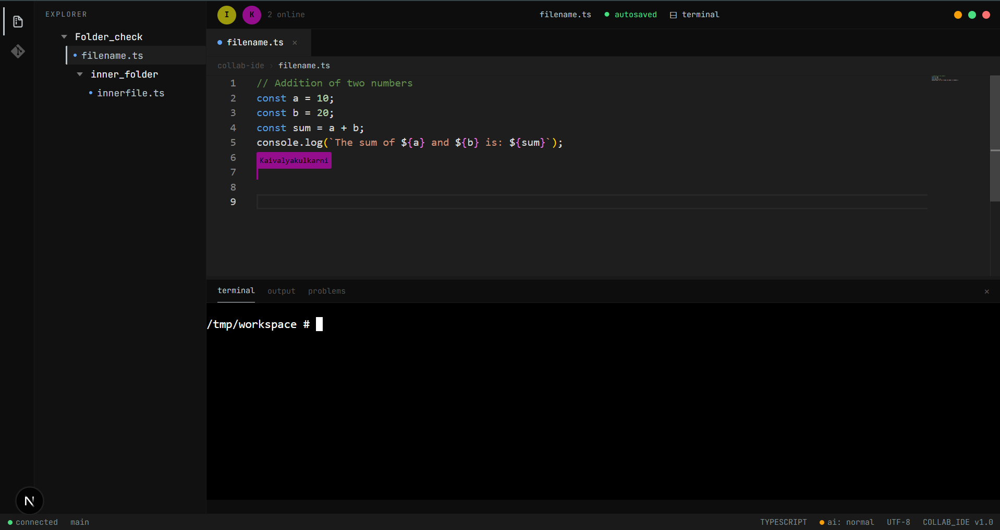

# Collab IDE

Built for Collaboration.  
Engineered for Developers.

A browser-native development workspace built to bring collaborative coding, secure execution, version control, and AI assistance into a single developer environment.

[Live Demo] · [Source Code]





## The Question That Started It All

How can multiple developers work on the same project at the same time without getting in each other's way?

Modern software development is collaborative by nature, but the workflow is still distributed across different tools.

Developers write code in one place, communicate somewhere else, run applications through another system, and manage changes through separate workflows.

Collab IDE started by exploring a simple idea:

> What if the entire collaborative development workflow could exist inside a single browser workspace?


# Product Tour

Collab IDE brings the complete development workflow into a single browser workspace — from creating a project to writing, running, and collaborating on code together.

---

## Create a Project

Every collaboration starts with a shared workspace.

Developers can create a project, configure the environment, and invite teammates to start building together from one place.


---

## Invite Members

A project becomes collaborative when the right people can join the workspace.

Members can be invited into the project, giving everyone a shared environment where code, changes, and progress stay connected.


---

## Collaborate in Real Time

The editor is where collaboration comes alive.

Multiple developers can work on the same codebase simultaneously, with synchronized files and live presence inside the workspace.


---

## Run and Debug

Writing code is only part of the workflow.

Collab IDE connects the editor with an integrated terminal and isolated execution environment, allowing developers to run and test their code without leaving the workspace.


---

## A Complete Development Workspace

From editing code to managing changes, Collab IDE brings essential development workflows together inside one environment.

Version control, AI assistance, and project management extend the collaborative experience beyond the editor.


# Engineering Pillars

Building a collaborative development environment required solving problems across real-time synchronization, secure execution, developer tooling, and intelligent assistance.

Each pillar represents a core system that makes the Collab IDE experience possible.

---

## Real-Time Collaboration

The foundation of Collab IDE.

Multiple developers need to edit the same codebase simultaneously without conflicts or inconsistent states.

To achieve this, Collab IDE uses a collaborative editing architecture that synchronizes changes in real time while maintaining each user's presence inside the workspace.

Built with:

- Yjs
- Monaco Editor
- WebSocket communication


---

## Secure Code Execution

Writing code is only useful when developers can run and test it.

Collab IDE provides an isolated execution environment that allows users to execute code safely without affecting the host system.

The execution layer handles:

- Running user programs
- Managing isolated environments
- Connecting execution results back to the workspace

Built with:

- Docker
- node-pty


---

## Integrated Developer Environment

A modern developer workflow requires more than just an editor.

Collab IDE connects the editor, terminal, file system, and project workspace into a single browser experience.

Developers can navigate files, execute commands, and manage their workflow without switching between different tools.

Built with:

- Monaco Editor
- xterm.js
- File system integration


---

## Version Control Inside the Browser

Collaboration also requires managing changes.

Collab IDE integrates Git workflows directly into the development environment, allowing projects to interact with repositories without leaving the browser.

Built with:

- isomorphic-git
- GitHub integration


---

## AI-Assisted Development

AI assistance extends the collaborative workflow by helping developers write and understand code faster.

The goal is not to replace developers, but to provide contextual support directly inside the workspace.

Built with:

- Groq API
- AI completion workflow


---

## Bringing Everything Together

Each system solves a different challenge, but they are designed around one goal:

Creating a complete browser-native environment where developers can build, run, and collaborate together.


# Architecture

Collab IDE is built as a distributed system where the frontend, backend services, real-time collaboration layer, execution environment, and external integrations work together to deliver a browser-native development experience.

Instead of treating editing, execution, version control, and collaboration as separate tools, Collab IDE unifies them into a single workspace where developers can build together without leaving the browser.


---

## High-Level Overview

The platform is composed of independent systems, each responsible for a specific part of the development workflow.

```text
                                   Browser
                                      │
                                      ▼
                         Next.js (Frontend Application)
                                      │
             ┌────────────────────────┼────────────────────────┐
             │                        │                        │
             ▼                        ▼                        ▼
      Authentication          Project Services        Collaboration Server
        (NextAuth)              (API Routes)          (Yjs + WebSockets)
             │                        │                        │
             └───────────────┬────────┴───────────────┬────────┘
                             ▼                        ▼
                     PostgreSQL Database      Shared Document State
                         (Supabase)
                             │
                             ▼
                        Prisma ORM
                             │
        ┌────────────────────┼────────────────────┐
        ▼                    ▼                    ▼
 Docker Sandbox         Git Integration      AI Assistance
 (node-pty)           (isomorphic-git)         (Groq API)
```

Each layer is isolated by responsibility, making the application easier to maintain, extend, and scale.

---

## Frontend Layer

The frontend provides the complete development experience inside the browser.

It is responsible for presenting every part of the workspace while keeping interactions responsive and synchronized.

### Responsibilities

- Authentication flow
- Project dashboard
- File explorer
- Monaco code editor
- Integrated terminal
- Real-time collaboration interface
- Project management screens

### Built With

- Next.js (App Router)
- React
- TypeScript
- Monaco Editor
- xterm.js


---

## Backend Layer

The backend coordinates the application's business logic and acts as the bridge between users, data, collaboration, and execution.

Rather than handling rendering, its primary responsibility is orchestrating the systems that power the workspace.

### Responsibilities

- User authentication
- Project management
- Workspace management
- Permission handling
- Repository operations
- Execution requests
- API endpoints

### Built With

- Next.js API Routes
- NextAuth v5
- Prisma ORM
- PostgreSQL (Supabase)


---

## Real-Time Collaboration Layer

Real-time collaboration is the foundation of Collab IDE.

Multiple developers should be able to edit the same project simultaneously while seeing each other's changes almost instantly.

Instead of relying on traditional request-response synchronization, Collab IDE uses Conflict-free Replicated Data Types (CRDTs) to synchronize document state across connected users.

### Collaboration Flow

```text
Developer A edits a file
          │
          ▼
     Monaco Editor
          │
          ▼
      Yjs Document
          │
          ▼
   WebSocket Broadcast
          │
          ▼
Developer B receives update
          │
          ▼
 Local editor synchronizes
```

### Built With

- Yjs
- WebSockets
- Monaco Editor
- CRDT Architecture


---

## Execution Layer

Writing code is only one part of development.

Developers also need to execute, test, and debug their applications safely.

Collab IDE isolates every execution request inside Docker containers, preventing user code from interacting directly with the host environment.

### Execution Flow

```text
Run Code
    │
    ▼
Execution Request
    │
    ▼
Docker Container
    │
    ▼
node-pty Terminal
    │
    ▼
Program Output
    │
    ▼
Browser Terminal
```

### Built With

- Docker
- node-pty
- xterm.js


---

## Version Control Layer

Collaboration extends beyond editing files.

Projects eventually need commits, branches, and synchronization with remote repositories.

Instead of depending on Git installed on a server, Collab IDE integrates browser-native Git operations directly into the workspace.

### Responsibilities

- Repository interaction
- Commit operations
- File synchronization
- Version tracking

### Built With

- isomorphic-git
- GitHub


---

## AI Assistance Layer

AI assistance is integrated directly into the development workflow rather than existing as a separate application.

Its role is to help developers write code faster while remaining inside the editor.

### Responsibilities

- Inline code assistance
- Context-aware suggestions
- Developer productivity

### Built With

- Groq API


---

## Data Layer

Persistent application state is managed through PostgreSQL using Prisma as the data access layer.

The database stores the information required to recreate projects, workspaces, and developer relationships.

### Stores

- Users
- Projects
- Members
- Files
- Permissions
- Workspace metadata

### Built With

- PostgreSQL
- Supabase
- Prisma ORM


---

## Architecture Principles

The architecture of Collab IDE follows a simple principle:

**Each system should have one responsibility.**

- The frontend focuses on developer experience.
- The backend coordinates application logic.
- The collaboration layer synchronizes developers.
- The execution layer safely runs code.
- The data layer persists application state.
- External services extend the platform without tightly coupling it to third-party providers.

Keeping these systems independent makes the application easier to reason about, test, and evolve as new features are added.

---

## Bringing Everything Together

No single technology defines Collab IDE.

The project is the result of multiple independent systems working together to solve one problem:

> **How can multiple developers build software together inside a single browser-native workspace?**

The chapters that follow explain the engineering decisions behind these systems and why specific technologies were chosen to build them.


# Engineering Decisions

Every technology in Collab IDE was chosen to solve a specific engineering problem.

This project wasn't built by collecting popular frameworks. Each decision was driven by a question that emerged while building a collaborative development environment.

This chapter explains **why** these technologies were chosen, the trade-offs they introduce, and the problems they solve.

---

## Why Yjs Instead of Traditional Synchronization?

The first challenge was enabling multiple developers to edit the same file simultaneously.

A traditional request-response model or periodically syncing file contents would quickly become unreliable when multiple users edited the same document at once. Conflicts, race conditions, and inconsistent editor states would become common.

Instead, Collab IDE uses **Yjs**, a CRDT-based synchronization framework that allows every participant to edit the same document concurrently while automatically merging changes.

### Why this decision?

- Conflict-free synchronization
- Near real-time updates
- Offline-friendly document model
- Automatic conflict resolution
- Proven collaborative editing architecture

### Trade-off

CRDTs introduce additional complexity compared to conventional state management, but they provide the consistency required for collaborative editing.

---

## Why Docker for Code Execution?

Allowing users to execute arbitrary code directly on the server presents significant security risks.

Running processes on the host machine would expose the application to malicious code, resource abuse, and unpredictable system behavior.

Collab IDE isolates every execution request inside Docker containers.

Each execution happens in a controlled environment that is separated from the application itself.

### Why this decision?

- Process isolation
- Improved security
- Consistent execution environment
- Easier dependency management
- Independent lifecycle for user programs

### Trade-off

Container creation introduces additional overhead compared to native execution, but the security and isolation benefits outweigh the performance cost.

---

## Why node-pty Instead of a Simulated Terminal?

A terminal should behave like a real terminal.

Simple command execution through HTTP requests would remove many of the interactive capabilities developers expect.

Collab IDE uses **node-pty** to create pseudo-terminal sessions that behave similarly to local terminal windows.

This enables interactive commands, streaming output, and continuous terminal sessions.

### Why this decision?

- Interactive shell support
- Streaming output
- Persistent terminal sessions
- Familiar developer experience

### Trade-off

Managing pseudo-terminal processes requires additional lifecycle management and cleanup compared to simple command execution.

---

## Why Separate the Collaboration Server?

Real-time collaboration has different requirements from standard API requests.

Authentication, project management, and database operations follow a request-response model.

Collaborative editing requires persistent, low-latency connections that continuously synchronize document state.

Separating the collaboration server keeps both responsibilities independent.

### Why this decision?

- Dedicated WebSocket infrastructure
- Lower synchronization latency
- Better scalability
- Separation of responsibilities

### Trade-off

Maintaining multiple services increases deployment complexity but creates a cleaner architecture.

---

## Why PostgreSQL with Prisma?

Projects contain structured relationships between users, members, files, permissions, and workspaces.

A relational database models these relationships naturally while maintaining data integrity.

Prisma provides type-safe database access and simplifies schema evolution.

### Why this decision?

- Relational data modeling
- Type-safe queries
- Migration support
- Strong developer experience

### Trade-off

Relational databases require schema planning, but they provide consistency and maintainability as the project grows.

---

## Why a Custom NextAuth Adapter?

During development, Prisma 7 compatibility with the official NextAuth Prisma Adapter introduced limitations.

Instead of blocking development or downgrading dependencies, Collab IDE implements a custom adapter using raw SQL queries.

This preserved compatibility while maintaining full authentication functionality.

### Why this decision?

- Compatibility with the chosen stack
- Full control over authentication queries
- Flexibility during development

### Trade-off

Custom implementations require additional maintenance compared to official adapters.

---

## Why isomorphic-git?

Traditional Git operations depend on a locally installed Git binary.

Collab IDE aims to keep development inside the browser as much as possible.

Using **isomorphic-git** makes browser-friendly Git workflows possible while reducing external dependencies.

### Why this decision?

- JavaScript implementation
- Browser compatibility
- Lightweight integration
- Easier deployment

### Trade-off

Not every advanced Git feature is available compared to the native Git CLI, but the functionality is well suited to the project's workflow.

---

## Why Groq for AI Assistance?

AI assistance should feel responsive enough to become part of the editing experience.

Fast inference significantly improves usability, especially for inline code suggestions.

Groq provides low-latency responses that integrate naturally into the development workflow.

### Why this decision?

- Fast inference
- Simple API integration
- Responsive developer experience

### Trade-off

The quality of responses depends on the selected language model and external API availability.

---

## Why Browser-Native?

Perhaps the biggest architectural decision was choosing to keep the development experience inside the browser.

Rather than treating the browser as a lightweight editor connected to external desktop tools, Collab IDE explores how much of the software development workflow can exist in a single environment.

This philosophy influenced every engineering decision throughout the project—from collaboration and execution to Git integration and AI assistance.

---

## Lessons from These Decisions

Every architectural decision introduced trade-offs.

Some increased implementation complexity.

Others required additional infrastructure.

Some demanded custom solutions where existing integrations were insufficient.

However, together they enabled something that a simpler architecture could not provide:

> **A browser-native collaborative development environment where developers can write, execute, manage, and collaborate on code without leaving the workspace.**

The next chapter explores the developer experience, local setup, and project structure for contributors interested in running or extending Collab IDE.

# Developer Guide

Whether you're exploring the codebase, contributing new features, or running the project locally, this chapter provides everything you need to get started.

The project is organized around clear separation of responsibilities, making it easier to understand how each system works independently while contributing to the overall collaborative experience.

---

# Project Structure

```text
collab-ide/
│
├── app/                  # Next.js App Router
├── components/           # Reusable UI components
├── lib/                  # Shared utilities
├── prisma/               # Database schema & migrations
├── public/               # Static assets
├── server/               # API logic & services
├── websocket/            # Collaboration server
├── docker/               # Sandbox configuration
├── styles/               # Global styles
└── ...
```

The project is intentionally organized by responsibility rather than feature duplication, allowing each system to evolve independently.

---

# Technology Stack

## Frontend

- Next.js (App Router)
- React
- TypeScript
- Monaco Editor
- xterm.js
- GSAP
- React Three Fiber

---

## Backend

- Next.js API Routes
- NextAuth v5
- Prisma ORM
- PostgreSQL (Supabase)

---

## Real-Time Collaboration

- Yjs
- WebSockets
- CRDTs

---

## Execution Environment

- Docker
- node-pty

---

## Developer Tools

- isomorphic-git
- Groq AI

---

# Getting Started

## 1. Clone the Repository

```bash
git clone https://github.com/your-username/collab-ide.git
cd collab-ide
```

---

## 2. Install Dependencies

```bash
npm install
```

---

## 3. Configure Environment Variables

Create a `.env` file and configure the required variables.

```env
DATABASE_URL=

NEXTAUTH_SECRET=
NEXTAUTH_URL=

GITHUB_CLIENT_ID=
GITHUB_CLIENT_SECRET=

GROQ_API_KEY=

WEBSOCKET_SERVER=

...
```

---

## 4. Start the Database

Run your PostgreSQL database (or connect to Supabase).

Apply Prisma migrations.

```bash
npx prisma migrate dev
```

---

## 5. Start the Collaboration Server

```bash
npm run websocket
```

This service synchronizes editor state between connected developers.

---

## 6. Start Docker

Ensure Docker is installed and running before executing user code.

Docker is responsible for creating isolated execution environments.

---

## 7. Start the Development Server

```bash
npm run dev
```

The application will be available at:

```text
http://localhost:3000
```

---

# Environment Requirements

Before running Collab IDE, make sure the following services are available:

- Node.js
- Docker
- PostgreSQL (or Supabase)
- GitHub OAuth Application
- Groq API Key

---

# Recommended Development Workflow

1. Create a new project.
2. Invite collaborators.
3. Open the shared editor.
4. Edit files collaboratively.
5. Execute code inside Docker.
6. Commit changes.
7. Continue building together.

Following this workflow provides the best understanding of how the different systems interact.

---

# Project Highlights

The easiest way to experience Collab IDE is to explore the features in the same order they were designed:

1. Authentication
2. Project Creation
3. Team Collaboration
4. Real-Time Editing
5. Integrated Terminal
6. Docker Execution
7. Git Integration
8. AI Assistance

Each feature builds upon the previous one, gradually forming a complete collaborative development environment.

---

# Contributing

Contributions are always welcome.

Whether you're fixing bugs, improving documentation, refining the user experience, or experimenting with new collaborative features, every contribution helps move the project forward.

If you'd like to contribute:

1. Fork the repository.
2. Create a feature branch.
3. Commit your changes.
4. Open a Pull Request.

Please include a clear description of the problem being solved and any relevant implementation details.

---

# What's Next?

Collab IDE continues to evolve.

Some of the planned improvements include:

- Integrated team chat
- Voice collaboration
- Shared debugging sessions
- Collaborative whiteboard
- Plugin system
- Multi-language execution support
- Smarter AI workflows
- Improved project management tools

These ideas continue the original mission of making collaborative software development feel natural inside the browser.

---

The final chapter reflects on what this project taught me, the challenges encountered along the way, and the lessons learned while building a browser-native collaborative development environment.

# Lessons Learned

Collab IDE started as an experiment in collaborative editing.

The original goal was simple:

> How can multiple developers work on the same project at the same time without getting in each other's way?

What began as a real-time editor gradually evolved into a much larger exploration of how modern developer tools interact with each other.

Building the project required understanding not only frontend development, but also distributed systems, synchronization, execution environments, infrastructure, authentication, terminal processes, databases, and developer workflows.

This chapter reflects on the most important lessons learned throughout that process.

---

## Collaboration Is More Than Shared Editing

At the beginning, collaboration seemed like a synchronization problem.

The assumption was:

> If multiple users can edit the same file simultaneously, collaboration is solved.

In reality, editing is only one part of the workflow.

Developers also need to:

- Run code
- Debug applications
- Manage files
- Track changes
- Communicate context
- Coordinate progress

This changed the direction of the project completely.

The editor stopped being the final product and became the foundation for a larger collaborative workspace.

---

## Real-Time Systems Change How You Think

Traditional web applications are mostly request-response driven.

Collaborative systems behave differently.

State changes continuously.

Multiple users interact simultaneously.

Connections stay persistent.

Synchronization becomes part of the application's core architecture rather than an isolated feature.

Building the collaboration layer introduced concepts like:

- CRDTs
- Shared state synchronization
- WebSocket communication
- Presence systems
- Conflict resolution

Understanding these systems changed how I think about application architecture.

---

## Developer Experience Matters as Much as Functionality

A feature can technically work while still feeling difficult to use.

Small details significantly affect how a development environment feels:

- Terminal responsiveness
- Editor synchronization speed
- File navigation
- Cursor presence
- Layout organization
- Workspace transitions

The project reinforced the idea that engineering is not only about implementing systems, but also about reducing friction for the people using them.

---

## Isolation and Security Become Essential Quickly

Allowing users to execute arbitrary code introduces serious responsibility.

Code execution cannot be treated as a normal backend feature.

Containerization, process isolation, and execution boundaries became critical parts of the architecture once the terminal and runtime systems were introduced.

This was one of the biggest shifts in the project:

> Features that appear simple on the surface often require significant infrastructure underneath.

---

## Building Integrated Systems Is Different from Building Individual Features

Many parts of Collab IDE worked independently before they worked together.

The real challenge was integration.

For example:

- The editor needed to synchronize with the collaboration layer.
- The terminal needed to stay connected to execution containers.
- Git workflows needed awareness of workspace state.
- Authentication needed to connect across multiple services.

The complexity came less from individual technologies and more from coordinating systems together reliably.

---

## The Hardest Part Was the Editor Workspace

The editor page became the center of the entire application.

It combined:

- Real-time collaboration
- File management
- Terminal integration
- Execution flow
- Workspace synchronization
- Presence systems
- UI coordination

Building this environment required solving frontend, backend, and infrastructure problems simultaneously.

It was also the part of the project that taught me the most.

---

## The Most Rewarding Moment

The most rewarding moment was seeing multiple cursors editing the same file successfully in real time.

That moment transformed the project from a collection of components into an actual collaborative system.

It was the point where the original idea finally felt real.

---

## What This Project Changed

Before building Collab IDE, I mostly viewed applications as frontend interfaces connected to APIs.

This project changed that perspective.

It demonstrated how professional products are built from multiple specialized systems working together:

- Collaboration infrastructure
- Execution environments
- Databases
- Networking layers
- Authentication systems
- Developer tooling

It also reinforced the importance of architecture decisions early in development.

---

## Future Direction

Collab IDE is still evolving.

Some of the ideas I want to continue exploring include:

- Integrated editor chat
- Shared debugging sessions
- Voice collaboration
- AI-aware collaboration
- Multi-user terminals
- Persistent collaborative workspaces

The goal remains the same as when the project started:

> Creating a browser-native environment where developers can build software together naturally.

---

# Final Thoughts

Collab IDE was never intended to replicate professional cloud IDEs feature-for-feature.

The project was built as an exploration of collaborative software development and the systems required to support it.

Every challenge introduced new areas of engineering to learn—from synchronization and infrastructure to security and developer experience.

More than anything, the project taught me how modern engineering products are designed:

not as isolated features,

but as connected systems working together to solve a real workflow problem.

---

## Built for Collaboration.
## Engineered for Developers.


---

# Explore Collab IDE

If you've made it this far, thank you for taking the time to explore the project.

Collab IDE began as a question about collaborative editing and gradually evolved into an exploration of what a complete browser-native development environment could look like.

Whether you're here to review the architecture, learn from the implementation, or contribute to the project, I hope this documentation gave you a clear understanding of both the product and the engineering decisions behind it.

---

## Try It Yourself

🌐 **Live Demo**

Experience real-time collaboration directly in your browser.

> [Live Demo](https://collab-ide-nine.vercel.app)

---

## Explore the Code

Interested in the implementation?

Browse the source code, architecture, and project history.

> [GitHub Repository](https://github.com/Kaivalyakulkarni/collab-Ide)

---

## Connect With Me

If you have feedback, suggestions, or simply want to discuss the project, I'd love to hear from you.

- GitHub: https://github.com/Kaivalyakulkarni
- LinkedIn: https://linkedin.com/in/...
- Email: your@email.com

---

<p align="center">

Built with by **Kaivalya Kulkarni**

**Built for Collaboration. Engineered for Developers.**

</p>
